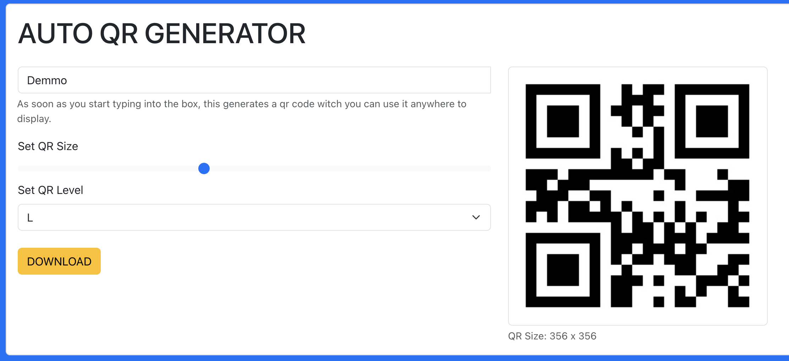

# React auto qr code generator

A simple QR code component for React apps which can help user to generate and download QR codes.

## Screenshots

## Features

1. Generates QR codes automatically
2. Fine tune QR based on Your needs of width
3. Set Level of error correction for your qr code, There are 4 L, M, Q, H. The level determines the percentage of the total QR code that is allowed to be dirty or damaged without being unable to read. Level L can be dirty/damaged for up to 7%, level M 15%, level Q 25%, level H 30%.
4. Download QR Code in JPEG format

## SetUp

1. Install the dependencies using `yarn install` or `npm i`.
2. Start the development server using yarn start.
3. Open [http://localhost:3000](http://localhost:300)
